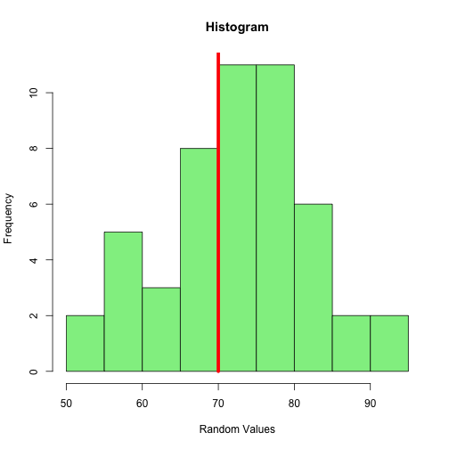

Mu Guessed It!
========================================================
author: Trevor Gast
date: Fri Oct 23 18:48:41 2015

My Shiny App - Mu Guessed It!
========================================================

Use your brain and some R to guess the mean of some normal random data values.

- Easy to use!
- Clever title!
- Hours of fun... ok, minutes!

Slide With Code
========================================================
transition: fade
The code selects a random mean between 68 and 72, then generates 50 normal random data values with standard deviation 10 using rnorm().


```r
ranMean <- floor(runif(1, min=68, max=72))
ranData <- rnorm(50, mean=ranMean, sd=10)
summary(ranData)
```

```
   Min. 1st Qu.  Median    Mean 3rd Qu.    Max. 
   51.0    66.0    73.2    72.6    78.9    92.9 
```

Slide With Plot
========================================================
transition: rotate
The data is presented with a histogram. The red line indicates the user's guess.

 

User Input
========================================================

The user can change the number of values in the data set from 50 up to 150 (increments of 10).

The standard deviation can be set from 1 to 20 as well.

There is a slider used to guess the mean (between 65 and 75)

Reactive Functions
========================================================

The function that generates the data set is set reactive to the values and standard deviation inputs. It is NOT reactive to the guessing slider. That way, a new data set is only generated when the number of values, or the standard deviation is adjusted.


```r
generate <- function(i1,i2){
    #create a random data set
    hideAnswer <<- TRUE
    ranMean <- floor(runif(1, min=68, max=72))
    ranData <- rnorm(i1, mean=ranMean, sd=i2)
}

shinyServer(
    function(input, output) {
        genData <- reactive({generate(input$val1,input$sd1)})
        }
)
```
